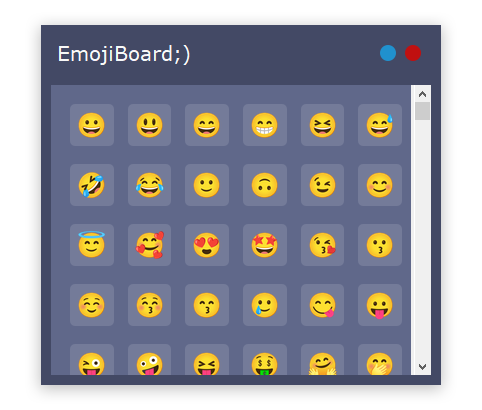

# EmojiBoard;)

## Cross-platform* on-screen keyboard for using emoji's

This project is a standardized way to type emojis in the major operating systems, Windows, macOS*, and Linux*.
It allows you to use emojis inside any app that supports emojis without needing to go to the Internet and search individual characters.



## Usage

In order to use the keyboard you need version of Python 3.8 or newer.

Clone the repository, setup virtual environment, install requirements

for Windows:

```shell
$ python -m venv venv
$ .\venv\Scripts\Activate
$ pip install -r requirements.txt
```

for Linux / macOS:

```shell
$ python3 -m venv venv
$ source venv/bin/activate
$ pip3 install -r requirements.txt
```

start `main.py`

### Recompile image files

The app uses pre-compiled PIL / pilmoji images. To recompile use `python render_emojis.py`

## Known issues and plans

*Linux, macOS support incoming

Here's list of possible future features:

* Organize emojis according to their category
* Display recently used emojis
* Search emoji by name
* Add settings to show, block certain categories
